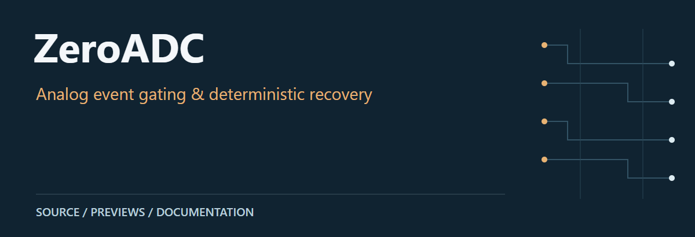
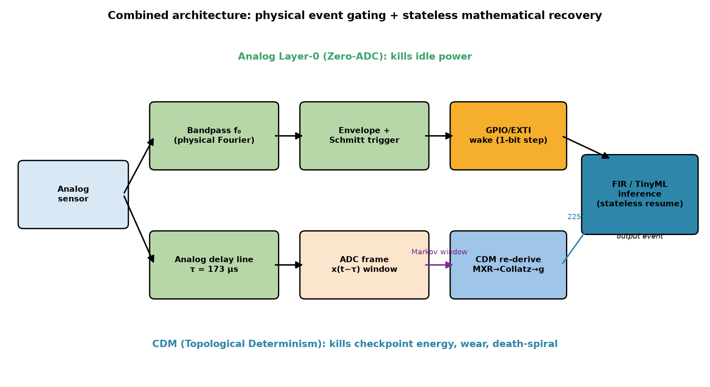
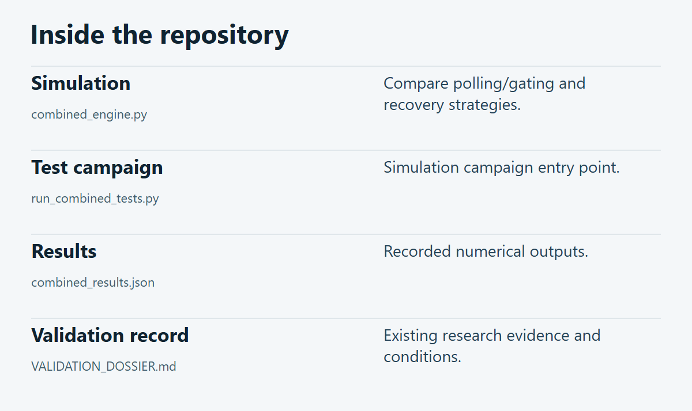

# ZeroADC

Research artifacts for a batteryless event-intelligence node combining an analog Zero-ADC front end with Collatz Deterministic Modelling (CDM). Includes simulation code, recorded results and MCU-related artifacts.

**[Source guide](#source-guide)** · **[Getting started](#getting-started)** · **[Scope & limitations](#scope--limitations)**

## Preview

Existing combined-node architecture figure. Consult the dossier for assumptions and evidence.

[Recorded result figures](figs) · [Raw results](combined_results.json) · [Validation dossier](VALIDATION_DOSSIER.md)

## Source guide

| Component | Open source | Purpose |
| :-- | :-- | :-- |
| Simulation | [`combined_engine.py`](combined_engine.py) | Compare polling/gating and recovery strategies. |
| Test campaign | [`run_combined_tests.py`](run_combined_tests.py) | Simulation campaign entry point. |
| Results | [`combined_results.json`](combined_results.json) | Recorded numerical outputs. |
| Validation record | [`VALIDATION_DOSSIER.md`](VALIDATION_DOSSIER.md) | Existing research evidence and conditions. |

## Getting started

Use the linked source files and project documents above as the entry points. Review the prerequisites and limitations below before execution.

## Scope & limitations

Read the dossier, model assumptions and raw results together. Simulation, emulation and hardware evidence are different categories. This documentation update did not rerun the campaign or validate headline performance claims.

---

[Visual asset sources and presentation notes](docs/visuals/README.md)
