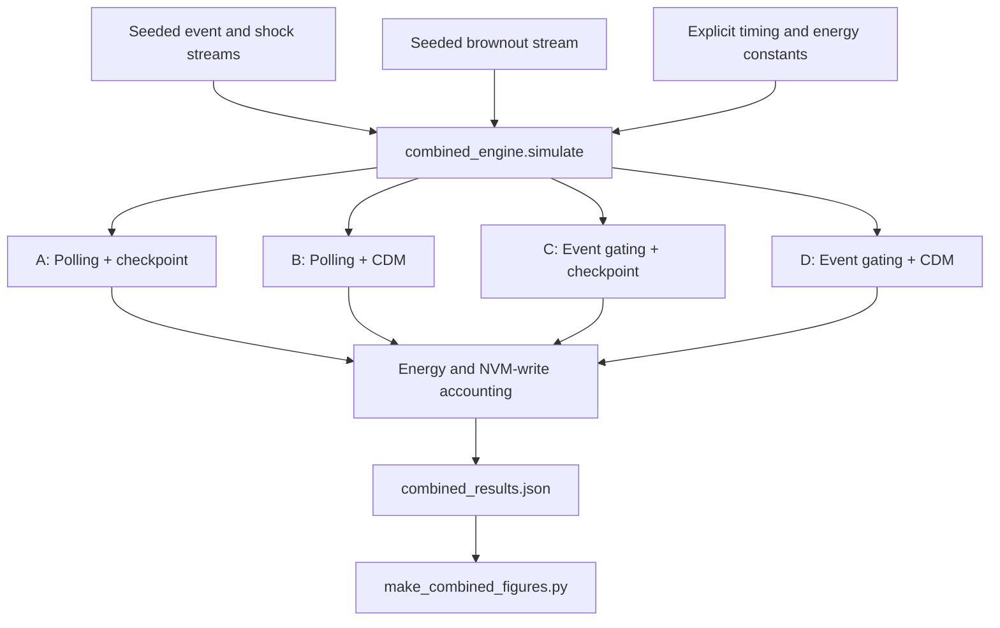
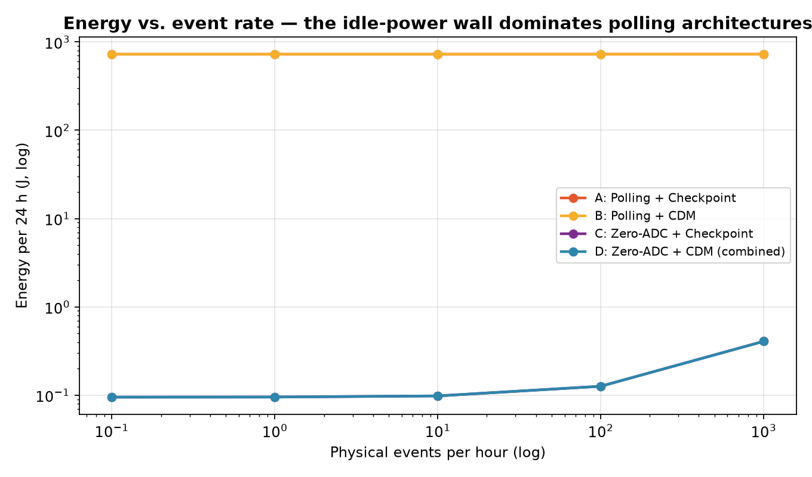
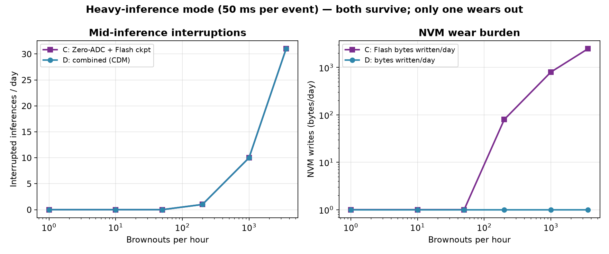

# ZeroADC

**Explore the trade-offs between continuous polling, event gating, and deterministic recovery.**

ZeroADC is a research prototype for batteryless sensing: Python models compare polling and event-gated architectures, with either checkpointing or **Collatz Deterministic Modelling (CDM)** for recovery. The repository also includes MCU reference implementations, archived logs, result files, and figures.

The central question is practical: **when does reducing idle activity matter more than reducing recovery overhead?** The code exposes its assumptions so those trade-offs can be inspected—not mistaken for measured system-level energy savings.

[Quickstart](#quickstart) · [Model architecture](#model-architecture) · [Repository figures](#repository-figures) · [Evidence boundaries](#evidence-boundaries)

## Model architecture



The sweep driver is [run_combined_tests.py](run_combined_tests.py). The separate [cdm_engine.py](cdm_engine.py) implements the MXR hash → masked Collatz trajectory → integer logarithm pipeline and FIR/energy-model helpers. **CDM here does not mean Charge Domain Modulator.**

“Zero-ADC” refers to the proposed idle/event-gating approach. The combined model still includes ADC acquisition setup after an event; it is not a claim that the complete sensing system never uses an ADC.

## Repository figures



*Repository figure; not rerun in this documentation refresh.*



*Repository figure; not rerun in this documentation refresh.*

These plots visualize the repository's modeled scenarios. They are not new rail-level measurements or evidence that a complete analog front end was built.

## Quickstart

### Browse the model and archived results

```bash
git clone https://github.com/MdSadman20040812/ZeroADC.git
cd ZeroADC
```

Start with [combined_engine.py](combined_engine.py), [combined_results.json](combined_results.json), and [VALIDATION_DOSSIER.md](VALIDATION_DOSSIER.md). No hardware is needed to inspect these artifacts.

### Regenerate figures from existing results

The figure script imports **NumPy** and **Matplotlib**. There is no dependency manifest in the repository. Install those packages in your chosen Python environment, then review the script's paths before invoking it:

```bash
python make_combined_figures.py
```

**Path prerequisite:** `make_combined_figures.py` reads `D:\Outputs\PaperFix\combined_results.json` and writes under `D:\Outputs\PaperFix\figs`. Update the result path and `FIG` variable for your checkout and ensure the output directory exists. Running the command without addressing those paths is not a portable quickstart.

### Reproduce the full simulation campaign

The existing entry point is:

```bash
python run_combined_tests.py
```

Before running it, supply the **UCI Individual Household Electric Power Consumption** dataset and adapt the hard-coded `D:\Outputs\PaperFix` import, data, and output paths. The expected input filename is `data/household_power_consumption.txt`; **that dataset is not included in this repository**. The script needs NumPy and writes its final JSON only after completing the campaign.

### Hardware and emulation

These are optional, separate reproduction paths—not part of the Python sweep command:

- [arduino/cdm_hw_test/cdm_hw_test.ino](arduino/cdm_hw_test/cdm_hw_test.ino) is the UNO sketch. Review it and compile it for the intended board before uploading.
- [arduino/run_hw_tests.py](arduino/run_hw_tests.py) uses pyserial, NumPy, Arduino CLI, `COM9`, and author-machine paths. It uploads firmware and captures serial output at 115200 baud. Review all paths and the actual port before using it; it does not compile the sketch itself.
- [renode/run.re](renode/run.re) loads an STM32L552 platform and the committed ELF, then reads memory markers. Its ELF path is absolute. [renode/gen_golden.py](renode/gen_golden.py) also requires the external household dataset.

Do not run the hardware helper against a connected board whose existing firmware you need to preserve.

## Source and evidence map

| Path | What it contains |
| --- | --- |
| [combined_engine.py](combined_engine.py) | Four-architecture accounting model and explicit constants |
| [cdm_engine.py](cdm_engine.py) | Deterministic primitives, FIR reference, and energy helpers |
| [run_combined_tests.py](run_combined_tests.py) | Parameter sweeps and dataset-dependent checks |
| [combined_results.json](combined_results.json), [results.json](results.json) | Archived numerical artifacts |
| [make_combined_figures.py](make_combined_figures.py), [figs/](figs/) | Plot generator and committed figures |
| [VALIDATION_DOSSIER.md](VALIDATION_DOSSIER.md) | Historical campaign narrative and stated open gaps |
| [arduino/HW_VALIDATION_REPORT.md](arduino/HW_VALIDATION_REPORT.md) | Historical UNO report |
| [arduino/hw_validation.json](arduino/hw_validation.json), [arduino/serial_log.txt](arduino/serial_log.txt) | Machine-readable results and serial evidence |
| [renode/app_cdm.c](renode/app_cdm.c), [renode/app.ld](renode/app.ld), [renode/run.re](renode/run.re) | Emulation source, linker script, and launch script |
| [generate_combined_paper.py](generate_combined_paper.py) | Paper-generation script |

## Evidence boundaries

- **Simulation is not rail measurement.** Power, timing, and memory-write costs are model inputs. The archived hardware report explicitly leaves joule measurements and the physical analog front end open.
- **Detection is assumed in the combined model.** Event counts are assigned from generated event times, and gated architectures exclude modeled shocks by construction. This does not measure missed events or real analog false-positive rates.
- **Recovery integrity needs an independent test.** The driver’s T6 computes the same FIR expression from the same window twice; it does not independently validate physical delay-line recovery or arbitrary lost program state.
- **Reset is not power loss.** The hardware report describes watchdog-reset testing and distinguishes it from cutting the power rail.
- **Costs are target-dependent.** The model's CDM cycle constant is not a measured cycle count for every MCU. Zero modeled checkpoint writes does not imply an unlimited device lifetime.
- Historical dossier prose, figure annotations, and source parameters should be reconciled before citing results. This documentation refresh did not rerun simulation, emulation, or hardware tests.
- No license file is present in the inspected repository tree.

## Contribute

Open an issue or pull request that states the assumption being tested and includes reproducible evidence. Useful directions are portable paths and dataset setup, independent recovery checks, measured rail energy, a physical event-gating prototype, and comparisons against simpler deterministic recovery baselines. Keep modeled estimates clearly separate from measurements.
