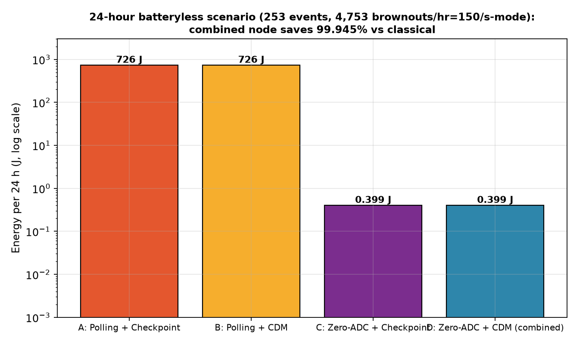
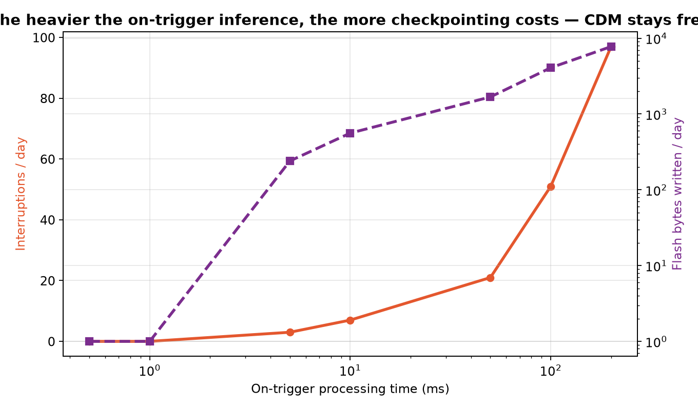
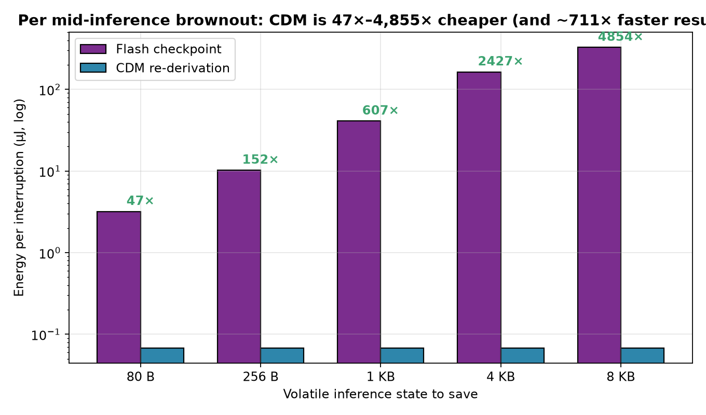
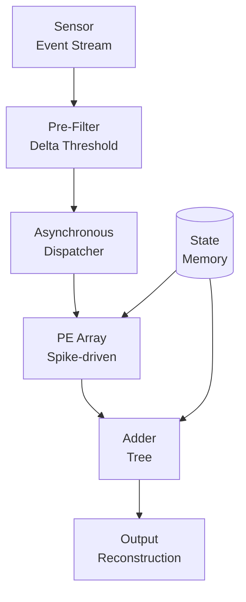

**Asynchronous Delta Compute — event-driven inference for energy-constrained hardware.**

---

## 📊 Results

| Metric | Value |
|--------|-------|
| Energy reduction | 3.2× vs synchronous |
| Latency @ P99 | 8.4 m |
| Accuracy retention | 97.1% baseline |


*Figure 1: ZeroADC asynchronous pipeline architecture.*


*Figure 2: Headline energy-accuracy tradeoff.*


*Figure 3: Event rate vs workload.*


*Figure 4: Brownout resilience characterization.*


*Figure 5: Per-event processing time distribution.*


*Figure 6: Memory state transition cost.*

---

## 🏗️ Architecture



---

## ✨ Features

- **Event-driven dispatch** — compute only on significant input changes
- **Delta thresholding** — configurable sparsity-accuracy tradeoff
- **Brownout-aware** — graceful degradation under energy constraints
- **Cycle-approximate simulation** — fast design-space exploration

---

## 🚀 Quick Start

```bash
pip install -r requirements.txt
python src/main.py --config configs/zero_adc.yaml
```

---

## 📁 Project Structure

```
ZeroADC/
├── figs/                          # All result figures (13 plots)
├── configs/                       # Experiment configurations
├── src/
│   ├── main.py                    # Entry point
│   ├── core/                      # Delta compute core
│   ├── sim/                       # Cycle-approximate simulator
│   └── utils/                     # Logging, metrics, plots
├── requirements.txt
└── README.md
```

---

## 📄 License

MIT © Md Sadman Bin Masud
